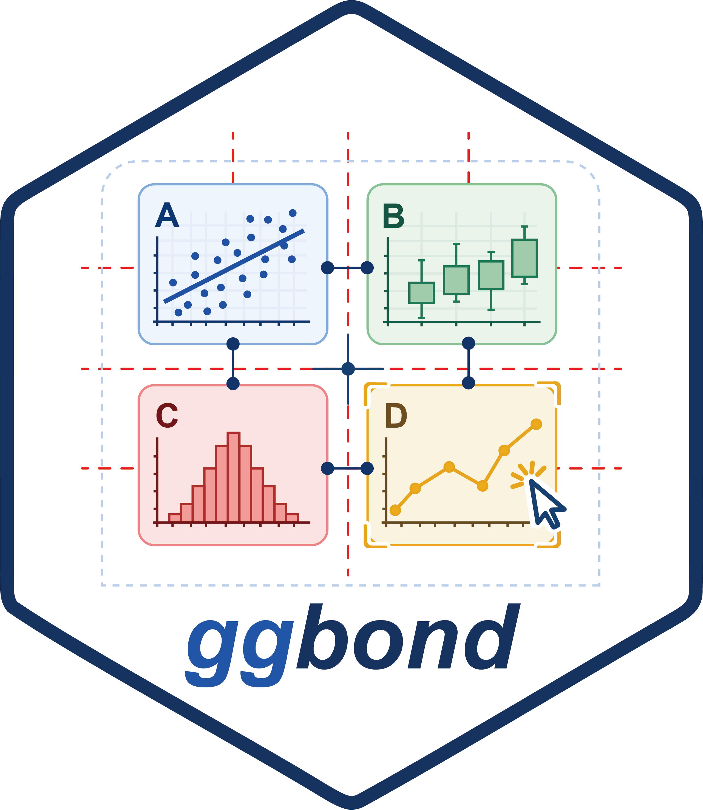

# ggbond 

 

ggbond is a Shiny-based layout editor for arranging R plots on a
fixed-size canvas. It lets you build multi-panel figures interactively,
then return a reusable `ggbond` layout object that can be rendered again
from R code.

The browser canvas and the final graphics device are linked by a
predictable pixel-to-inch mapping, so a layout made interactively can be
exported or reproduced later without manually rebuilding the figure.

## Features

- Add, delete, move, resize, align, layer, and label panels on a
  fixed-size canvas.
- Select multiple panels with Ctrl or Command.
- Align selected panels by left, right, horizontal center, top, vertical
  center, or bottom edge.
- Match selected panel sizes with equal-width, equal-height, and
  equal-size actions.
- Move selected panels with arrow keys; hold Shift for larger steps.
- Undo movement, resizing, alignment, sizing, and layering changes with
  Ctrl or Command plus Z.
- Render ggplot2 plots, base graphics functions or recorded plots,
  pheatmap objects, ComplexHeatmap objects, grid grobs, gtables, and
  uploaded PNG, JPG, or TIFF images.
- Lock aspect ratios for image panels.
- Optionally draw borders around selected rendered panels.
- Preview the layout in a fixed-size R graphics window.
- Export the current layout to PDF or PNG.
- Return a `ggbond` object after exiting Shiny.
- Save and restore `ggbond` layout objects as JSON.

## Installation

Install the development version from GitHub:

``` r
install.packages("devtools")
devtools::install_github("RightSZ/ggbond")
```

During local development from the package directory:

``` r
devtools::load_all("ggbond")
```

## Quick Start

``` r
library(ggbond)

layout <- run_ggbond()
layout
```

The demo app includes ggplot2 plots, a base R plot, and optional
pheatmap and ComplexHeatmap examples when those packages are installed.

Click **Exit Shiny** or close the browser session when you are done. The
return value is a `ggbond` object containing the panel layout, canvas
size, graphics device size, uploaded image metadata, and exit reason.

## Custom Plots

Pass a named list of plot objects to `run_ggbond()`.

``` r
library(ggplot2)
library(ggbond)

plots <- list(
  scatter = ggplot(mtcars, aes(wt, mpg)) +
    geom_point() +
    theme_classic(),
  base = function() {
    plot(mtcars$wt, mtcars$mpg, pch = 19, xlab = "wt", ylab = "mpg")
  }
)

layout <- run_ggbond(plots)
```

Supported plot sources include ggplot2 objects, base graphics functions,
recorded plots, pheatmap objects, ComplexHeatmap objects, grobs, gtables,
and uploaded raster images.

## Re-render From Code

Use `render_ggbond()` with the saved layout and the same named
`plot_list`.

``` r
render_ggbond(layout, plots, file = "figure.pdf")
render_ggbond(layout, plots, file = "figure.png", res = 300)
```

If `file` is omitted, the layout is drawn on the current graphics device:

``` r
pdf("figure.pdf", width = layout$device$width_in, height = layout$device$height_in)
render_ggbond(layout, plots)
dev.off()
```

## Save Layouts

Save a layout object to JSON and read it back later:

``` r
save_ggbond_json(layout, "layout.json")

layout2 <- read_ggbond_json("layout.json")
render_ggbond(layout2, plots, file = "figure.pdf")
```

The JSON file stores layout metadata, not the original plot objects. Keep
the named plot list available when you want to render the restored
layout.

Uploaded local images are stored by path in the layout metadata. They can
be rendered later as long as those files still exist at the recorded
paths.

## Canvas And Device Size

Canvas and device sizes are linked at 100 pixels per inch. If only one
size pair is supplied, the other pair is derived automatically.

``` r
run_ggbond(device_width_in = 20, device_height_in = 15)
# Uses a 2000 x 1500 px canvas.

run_ggbond(canvas_width_px = 2000, canvas_height_px = 1500)
# Uses a 20 x 15 inch graphics device.
```

You can also supply both pairs explicitly:

``` r
run_ggbond(
  canvas_width_px = 1500,
  canvas_height_px = 1000,
  device_width_in = 15,
  device_height_in = 10
)
```

## Browser Workflow

1. Click **Add panel** to add a panel to the canvas.
2. Use the panel dropdown to choose a plot or uploaded image source.
3. Drag panels to move them and use the bottom-right handle to resize.
4. Hold Ctrl or Command while clicking panels to multi-select.
5. Use the inspector to align panels, match sizes, change layer order,
   toggle borders, or lock image aspect ratios.
6. Use arrow keys for fine movement; hold Shift for larger movement.
7. Click **Open fixed R plot window** when you want a live external
   preview.
8. Export with **Export PDF** or **Export PNG**, or click **Exit Shiny**
   to return the `ggbond` layout object to R.

## Heatmap Examples

For pheatmap:

``` r
plots <- list(
  heatmap = pheatmap::pheatmap(as.matrix(mtcars[1:10, 1:6]), silent = TRUE)
)

layout <- run_ggbond(plots)
```

For ComplexHeatmap:

``` r
plots <- list(
  complex = ComplexHeatmap::Heatmap(as.matrix(mtcars[1:10, 1:6]))
)

layout <- run_ggbond(plots)
```

## Notes

Base graphics are converted to grid output with gridGraphics when
possible so PDF output remains vector-based. If conversion fails for a
custom base graphics function, ggbond falls back to high-resolution
raster rendering for that panel.

For large or complex layouts, keyboard movement is batched: panels move
immediately in the browser, but the external R graphics preview is
updated after the arrow key is released. This keeps the Shiny session
responsive when many panels are present.
